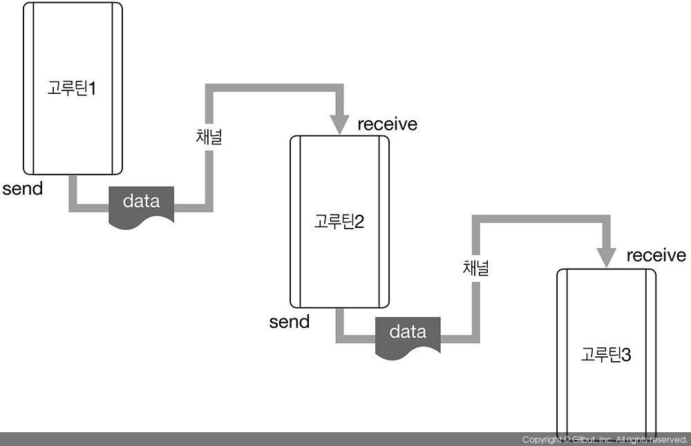

# **채널**
## **채널이란?**
- **채널**(channel)은 **고루틴끼리 정보를 교환**하고 실행의 흐름을 **동기화**하기 위해 사용한다.

 

**고루틴과 채널의 전체적인 흐름**

 

---
## **채널의 생성과 사용**
- **채널**은 일반 변수를 선언하는 것과 똑같이 선언하고, **make() 함수**로 생성한다.
- **채널**을 정의할 때는 **chan 키워드**로 채널을 통해 **주고받을 데이터 타입**을 지정한다.
- 하지만 채널의 타입을 **interface{}** 로 지정하면 **타입에 상관없이** 주고 받을 수 있다.
    ~~~go
    // 채널 변수 선언 후 make() 함수로 채널 생
	var ch chan string
	ch = make(chan string)

	// make() 함수로 채널 생성 후 바로 변수에 할당
	done := make(chan string)
    ~~~

 

- 또한, **채널**로 **값**을 주고 받을 때는 **<- 연산자**를 사용한다.
- **<-** 를 채널 **변수 오른**쪽에 사용하면 **채널**에 값을 **전송**한다.
- **<-** 를 채널 **변수 왼쪽**에 사용하면 **채널**로 부터 값을 **수신**한다.
- **채널**에 값을 **전송**하거나 **수신**할 때 채널이 준비되지 않으면 **준비될 때 까지  대기**한다.
    ~~~go
    ch <- "msg" // ch 채널에 "msg" 전송
    m := <-ch   // ch 채널로부터 메세지 수신
    ~~~

 

---
## **고루틴과 채널을 사용한 예시 코드**
~~~go
package main

import (
	"fmt"
	"time"
)

func main() {
	fmt.Println("main 함수 시작", time.Now())

	done := make(chan bool)
	go long(done)
	go short(done)

	<-done
	<-done
	fmt.Println("main 함수 종료", time.Now())
}

func long(done chan bool) {
	fmt.Println("long 함수 시작", time.Now())
	time.Sleep(3 * time.Second) // 3초 대기
	fmt.Println("long 함수 종료", time.Now())
	done <- true
}

func short(done chan bool) {
	fmt.Println("short 함수 시작", time.Now())
	time.Sleep(1 * time.Second) // 1초 대기
	fmt.Println("short 함수 종료", time.Now())
	done <- true
}

~~~
~~~
실행 결과

main 함수 시작 2019-11-20 23:33:37.830138 +0900 KST m=+0.000053453
short 함수 시작 2019-11-20 23:33:37.830284 +0900 KST m=+0.000199975
long 함수 시작 2019-11-20 23:33:37.830325 +0900 KST m=+0.000240986
short 함수 종료 2019-11-20 23:33:38.832817 +0900 KST m=+1.002722606
long 함수 종료 2019-11-20 23:33:40.830825 +0900 KST m=+3.000711925
main 함수 종료 2019-11-20 23:33:40.830855 +0900 KST m=+3.000741883
~~~

 

- 함수로 **done 채널**을 전달하고, 각 **함수**에서는 **처리**를 완료한 후 **done 채널**로 완료 메세지 전달.
- 메인 함수에서는 **done 채널**로부터 메세지를 받고 **프로그램을 종료**한다.

 

---
## **여전히 남아있는 교착상태의 위험**
- **동시성**을 처리할 때 **sync** 패키지의 **저수준 기능**이 아니라, **채널**을 사용한다 해도 **교착상태** 위험은 여전히 남아있다.

- 예를 들어, 서로 **데이터를 주고 받는 고루틴**이 있을 경우 **교착상태**에 빠질 수 있다.
	- **고루틴1**은 고루틴2로부터 **데이터를 받아** 처리한 후 결과를 **고루틴2**로 보냄
	- **고루틴2**도 **데이터를 받아** 처리한 다음, 다시 **고루틴1**로 전달하는 상황.

- 따라서 **Go**는 **교착상태**와 **경쟁상태**를 테스트하기 위해 **Race Detector**를 제공한다.
	- **사용 방법**
	~~~
	go test -race mypkg
	go run -race mysrc.go
	go build -race mypkg
	go install -race mypkg
	~~~
