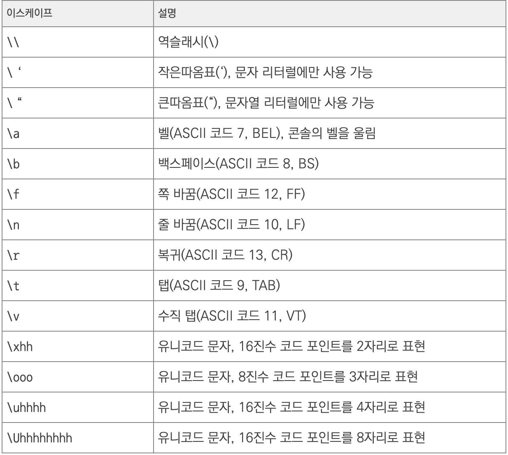
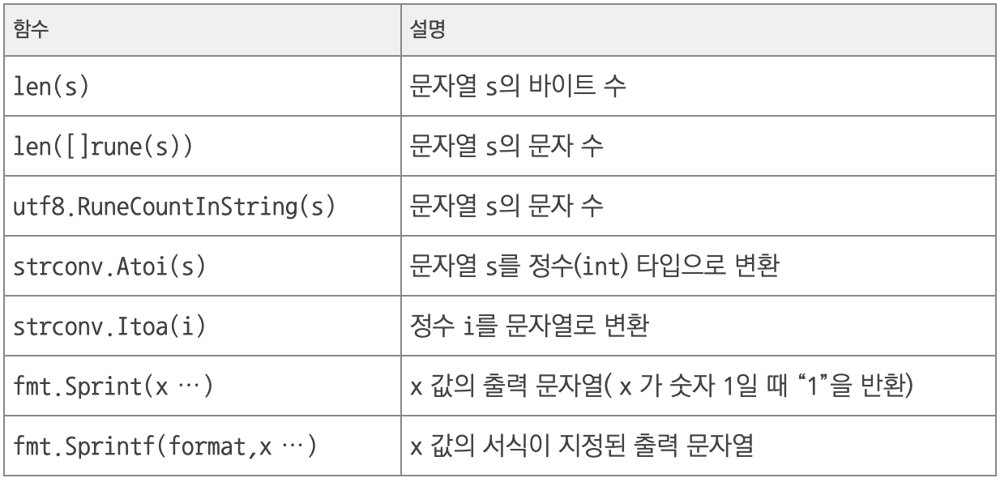
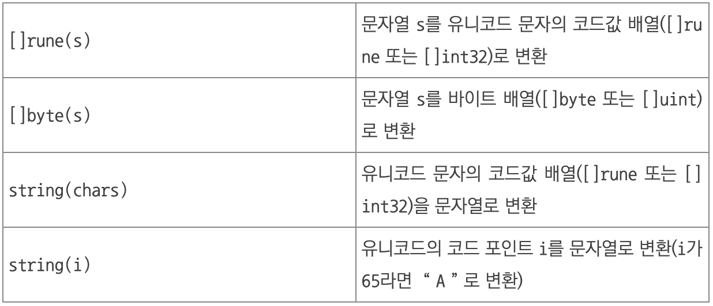

# **문자열**

## **Go의 문자열**
- **문자열**(string)은 보통은 **큰따음표**(")로 혹은 **벡쿼트**(`)로 생성한다.
- **백쿼트**로 생성하면 **이스케이프 문자**와 **줄 바꿈**을 **무시**한다.
- 따라서 다음 **두 문자열은 같다**.
~~~go
path1 := "c:\\workspace\\go\\src\\"
path2 := `c:\workspace\go\src`
~~~

 

**문자**나 **문자열**에서 사용하는 **이스케이프**를 표시한 표이다.

 

다음은 자주 사용하는 **문자열 관련 함수**이다.

 

---
## **Go의 문자**
- 사실은 엄밀히 말하자면 Go에는 **문자**(character)타입이 **없다**.
- 문자를 표현하려면 **정수 타입인 rune**(int32의 별칭)으로 **문자의 코드값**을 사용해야 한다.
    ~~~go
    var ch1 rune = 'A'
    var ch2 rune = 65       // 10 진수로 코드값 표현식
    var ch3 rune = '\x41'   // 16 진수로 코드값 표현식
    var ch4 rune = '\101'   // 8 진수로 코드값 표현식

    var unicode1 rune = '\u0041'     // 코드 포인트가 4자리인 유니코드
    var unicode2 rune = '\uAC00'    
    var unicode3 rune = '\U00101234' // 코드 포인트가 8자리인 유니코드
    ~~~

 

---
## **문자열의 내부 문자 접근**
- 문자열 내부에 **바이트 단위**로 접근할 때는 **인덱스**([])를 사용한다.

~~~go
s := "hello"
fmt.Println(s[0])           // 104: 문자열 s의 첫 번째 문자 'h'의 코드값
fmt.Println(s[len(s)-1])    // 111: 문자열 s의 마지막 문자 'o'의 코드값
~~~

 

- 하지만 문자열은 **UTF-8 인코딩**을 사용한 **유니코드 문자**의 집합이다.

- **유니코드**는 문자에 따라 **바이트 수가 다르므로** 인덱스로 문자열 내부에 접근할 때는 **주의**해야 한다.
    1. 문자열 내부에 접근 - **문자열에 인덱스 사용**
        ~~~go
        s1 := "hello"
        s2 := "안녕하세요"
        
        fmt.Printf("str1: %c %c %c %c %c", s1[0], s1[1], s1[2], s1[3], s1[4])
        fmt.Printf("str2: %c %c %c %c %c", s2[0], s2[1], s2[2], s2[3], s2[4])
        ~~~
        ~~~
        실행 결과

        str1: h e l l o
        str2: ì   ë 
        ~~~
    2. 문자열 내부에 접근 - **문자열을 []rune 타입으로 변환 후 접근** (더 안전한 방식)
        ~~~go
        s1 := "hello"
        s2 := "안녕하세요"
        
        r1 := []rune(s1)
        r2 := []rune(s2)
        
        fmt.Printf("str1: %c %c %c %c %c\n", r1[0], r1[1], r1[2], r1[3], r1[4])
        fmt.Printf("str2: %c %c %c %c %c\n", r2[0], r2[1], r2[2], r2[3], r2[4])
        ~~~
        ~~~
        실행 결과

        str1: h e l l o
        str2: 안 녕 하 세 요
        ~~~

- 또한 **for ... range구문**을 이용해서 문자열 내부 문자에 **순차적으로 접근**할 수 있다.
    ~~~go
    package main

    import (
        "fmt"
    )

    func main() {
        s1 := "hello"
        s2 := "안녕하세요"
        for i, c := range s1 {
            fmt.Printf("%c(%d)\t", c, i)
        }
        fmt.Println()
        for i, c := range s2 {
            fmt.Printf("%c(%d)\t", c, i)
        }
    }
    ~~~
    ~~~
    실행 결과

    h(0)    e(1)    l(2)    l(3)    o(4)    
    안(0)   녕(3)   하(6)   세(9)   요(12)
    ~~~

 

---
## **문자열 변환**
- 문자열은 **유니코드 문자**의 코드값을 정수로 표현한 값의 시퀀스이므로 **[]rune(또는 []int32)** 으로 변환할 수 있다.
- 또한 **1바이트**로 표현할 수 있는 **아스키 문자열**은 **[]byte(또는 []uint8)** 로 변환할 수 있다.
- **아스키가 아닌 문자열**을 **[]byte**로 변환하면 **잘못된 코드값**으로 변환될 수 있으니 주의해야한다.

 

다음 표는 **문자열 변환** 시 쓰이는 함수들이다.

 

- 실제로 **문자열 <-> 코드값 변환 코드**를 작성해보고 결과값을 보자.
    ~~~go
    s1 := "hello"

	fmt.Println([]rune(s1))	// [104 101 108 108 111]
	fmt.Println([]byte(s1)) // [104 101 108 108 111]

	fmt.Println(string([]byte{104, 101, 108, 108, 111})) // hello
	fmt.Println(string([]rune{104, 101, 108, 108, 111})) // hello

	s2 := "안녕하세요"

	fmt.Println([]rune(s2)) // [50504 45397 54616 49464 50836]
	fmt.Println([]byte(s2)) // [236 149 136 235 133 149 237 149 152 236 132 184 236 154 148]

	fmt.Println(string([]rune{50504, 45397, 54616, 49464, 50836})) // 안녕하세요
	fmt.Println(string([]byte{236, 149, 136, 235, 133, 149, 237, 149, 152, 236, 132, 184, 236, 154, 148})) // 안녕하세요

	fmt.Println(string(104)) // h
	fmt.Println(string(236)) // ì
	fmt.Println(string(50504))
	fmt.Println(string([]byte{236, 149, 136})) // 안
    ~~~

 

---
## **문자열 길이**
- 문자열의 **바아트 수**를 구할 때는 **len()** 함수를 사용한다.

- 바이트가 아니라 문자열의 **내부 문자수**를 구할 때는
    - **unicode/utf8** 패키지의 **utf8.RuneCountInString()** 함수를 사용하거나
    - 문자열을 **[]rune** 타입으로 변환하여 **len([]rune(s))를** 구하면 된다.

~~~go
package main

import (
    "fmt"
    "unicode/utf8"
)

func main() {
    s1 := "hello"
    s2 := "안녕하세요"

    fmt.Println(len(s1))                    // 5
    fmt.Println(len(s2))                    // 15
    fmt.Println(utf8.RuneCountInString(s2)) // 5
    fmt.Println(len([]rune(s2)))            // 5
}
~~~