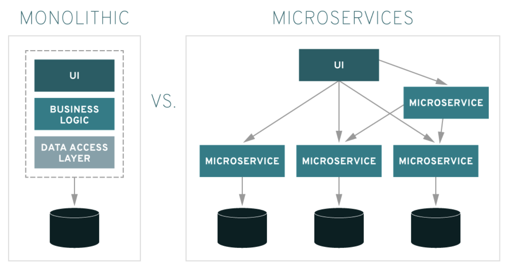

# **Building Microservices with Go**

## **시작하기 전에...**
- **닉 잭슨** 저자의 **Building Microservices with Go** 책에 나온
- **설명**들을 **참조**하여 주석을 동반한 **코드들을 작성**했음을 일립니다.

 

---
## **마이크로서비스란?**
- **마이크로서비스**는 어플리케이션 구축을 위한 **아키텍처 기반의 접근방식**이다.
- 전통적인 **모놀리식** 접근 방식과 **구별 짓는 기준**은 어플리케이션을 **핵심 기능으로 세분화**하는 방식이다.
- 각 기능을 **서비스**라고 부르며, **독립적**으로 **구축**하고 **배포**할 수 있습니다.

 

---
## **Go를 이용한 마이크로서비스 개발**
- **Go언어**는 **마이크로서비스 아키텍처**를 구축하기 위해 필요한 **요소**들을 잘 갖추고 있다.
- **Go언어**의 자연스러운 **문법** 및 정적으로 연결된 **바이너리 산출물**은 다른 기술과 **쉽게 통합**할 수 있게 해준다.
- 또한 일관성 있고 직관적인 방식으로 **마이크로서비스**의 **규모를 관리**하게 해준다.
- 따라서 **앞으로 나올 코드**들은 Go 프로그래밍 언어를 사용해 **패턴**을 **적용**하는 방법을 보여준다.

 

---
## **앞으로 나올 내용들**
- 마이크로서비스를 작성하는 데 필요한 **모든 구성 요소**를 갖춘 **표준 라이브러리**의 사용법
- **Docker** 및 **Docker Compose** 사용 방법
- 단위 테스트, 행위 테스트 및 성능 테스트 및 **주요 테스트 프레임워크**
- 부하 분산, 회로 차단, 서비스 탐색 및 **자동 조종 패턴**
- **StatsD**를 사용하는 방법, **로그 파일 정보**를 처리하는 방법
- 마이크로서비스의 **인증**, 권한 부여 및 **보안**
- **이벤트**를 사용해 마이크로서비스가 **공동 작업**을 수행할 수 있도록 하는 **일반적인 패턴**
- **지속적인 딜리버리**에 대한 개념